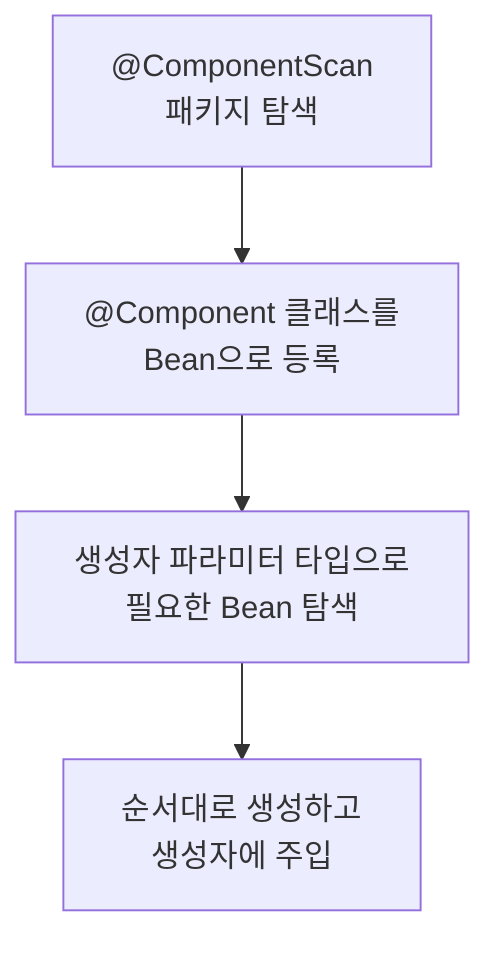

# 의존성 주입은 무슨 문제를 푸는가

## 1. 핵심 개념: IoC와 DI란?

- IoC(Inversion of Control)는 객체를 만들고 연결하는 **제어권을 코드 대신 컨테이너에 넘기는 것**입니다.
- DI(Dependency Injection)는 IoC를 구현하는 방법 중 하나입니다. 필요한 객체를 외부에서 밀어넣어 줍니다.
- `new`로 직접 만들면 교체 불가능, 공유 어려움, 생명주기 관리 코드 혼입 세 가지 문제가 생깁니다. DI는 이 세 가지를 컨테이너에 위임해서 해결합니다.

> **"제어권의 역전" — 객체가 스스로 의존성을 찾아 나서지 않고, 누군가(컨테이너) 넣어줄 때까지 기다립니다.**

## 2. 구조

- **`ApplicationContext`**: Bean을 등록하고 생성·주입까지 책임지는 컨테이너입니다.
- **Bean**: `@Component`(와 그 별칭인 `@Service`, `@Repository`, `@Controller`)가 붙어 컨테이너가 관리하는 객체입니다.
- **주입받는 클래스**: 생성자에 필요한 타입을 선언해두면, 컨테이너가 알아서 찾아서 넣어줍니다.

### 2-1. 선택적 확장 지점

- 의존성이 항상 필수인 건 아닙니다. `Optional<T>`로 선언하면 "있으면 쓰고 없으면 안 쓰는" 선택적 의존성을 명시적으로 표현할 수 있습니다.
- `@Autowired(required = false)`도 같은 목적이지만, `null`이 조용히 들어와 위험합니다. (10장 함정 참고)

## 3. Bean 등록·주입 흐름

### 3-1. 클래스 구성



```java
@Service
public class OrderService {
    private final UserRepository userRepository;
    private final PaymentClient paymentClient;

    public OrderService(UserRepository userRepository, PaymentClient paymentClient) {
        this.userRepository = userRepository;
        this.paymentClient = paymentClient;
    }
}
```

### 3-2. 실행 흐름

```
1. @ComponentScan이 OrderService, JpaUserRepository, PaymentClient를 발견
2. 각 클래스를 Bean으로 등록
3. OrderService의 생성자 파라미터(UserRepository, PaymentClient) 타입으로 Bean 검색
4. UserRepository, PaymentClient를 먼저 생성
5. OrderService(userRepository, paymentClient) 호출 — 컨테이너가 대신 new를 실행
```

## 4. 특징

### 4-1. 사용 시기

- Spring Bean으로 등록해 관리할 객체가 둘 이상의 다른 Bean에서 재사용될 때
- 테스트에서 실제 구현체를 가짜 객체로 바꿔치기해야 할 때
- 객체의 생성·해제 시점을 코드가 아니라 컨테이너가 관리해야 할 때

### 4-2. 장점

- 구현체 교체가 인터페이스 하나로 끝납니다. 테스트에서 가짜 객체를 주입하기 쉽습니다.
- 싱글톤 관리, 생명주기 관리를 컨테이너가 대신 해줘서 비즈니스 코드가 깔끔해집니다.
- 생성자 주입을 쓰면 Spring 컨테이너 없이도 순수 Java 코드로 단위 테스트를 만들 수 있습니다.

### 4-3. 단점 / 트레이드오프

- `@Service`, `@Autowired` 같은 애노테이션이 들어오는 순간 순수 Java 클래스가 아니게 됩니다. 코드가 Spring에 묶입니다.
- Spring을 쓸 이유가 없는 작은 CLI 툴이나 라이브러리라면 이 비용이 낭비입니다. `main()`에서 직접 `new`가 낫습니다.
- Bean 등록·주입 과정이 한 단계 더 생겨서, 처음 보는 사람은 "이 객체가 어디서 만들어지는지" 코드만 봐서는 바로 안 보입니다.

## 5. 예제: `new` 직접 생성 VS 생성자 주입

### 5-1. 클린하지 않은 코드 ❌

```java
public class OrderService {
    // ❌ 구현체가 코드에 박혔다. 테스트에서 교체 불가
    private final UserRepository userRepository = new JpaUserRepository();
}
```

- 테스트에서 실제 DB 대신 가짜 객체를 넣고 싶어도 교체할 방법이 없습니다.
- `OrderService`와 `PaymentService`가 같은 `UserRepository` 인스턴스를 써야 한다면 싱글톤을 직접 구현해야 합니다.

### 5-2. 생성자 주입을 적용한 코드 ✔️

```java
@Service
public class OrderService {
    private final UserRepository userRepository;
    private final PaymentClient paymentClient;

    public OrderService(UserRepository userRepository, PaymentClient paymentClient) {
        this.userRepository = userRepository;
        this.paymentClient = paymentClient;
    }
}
```

```java
// Spring Context 없이 단위 테스트 작성 가능
@Test
void 존재하지_않는_사용자_주문시_예외() {
    UserRepository fakeRepo = new FakeUserRepository();
    PaymentClient fakePayment = new FakePaymentClient();
    OrderService orderService = new OrderService(fakeRepo, fakePayment);

    assertThrows(UserNotFoundException.class, () -> orderService.order(-1L));
}
```

## 6. 헐리우드 원칙 준수

- 헐리우드 원칙: **"Don't call us, we'll call you."** — 낮은 레벨의 코드가 상위(컨테이너)를 직접 호출하지 않고, 상위가 필요할 때 하위를 호출합니다.
- IoC는 이 원칙을 그대로 구현한 것입니다. `OrderService`는 `UserRepository`를 어떻게 찾을지 몰라도 됩니다. 컨테이너가 알아서 찾아서 건네줍니다.

### 6-1. 원칙을 어긴 코드 ❌

```java
public class OrderService {
    private UserRepository userRepository;

    public OrderService() {
        // 서비스가 직접 구현체를 찾아 만든다 — 제어권이 OrderService 자신에게 있다
        this.userRepository = new JpaUserRepository(DataSourceHolder.get());
    }
}
```

- `OrderService`가 `UserRepository`의 구체적인 생성 방법(`DataSourceHolder` 접근 등)까지 알아야 합니다.
- `DataSourceHolder`가 바뀌면 `OrderService`도 같이 고쳐야 합니다.

### 6-2. 원칙을 지킨 코드 ✔️

```java
@Service
public class OrderService {
    private final UserRepository userRepository;

    public OrderService(UserRepository userRepository) {
        // 어떻게 만들어졌는지 OrderService는 모른다 — 그냥 받는다
        this.userRepository = userRepository;
    }
}
```

- `OrderService`는 `UserRepository`가 JPA인지, JDBC인지, 심지어 테스트용 가짜인지 알 필요가 없습니다.
- 생성 방법이 바뀌어도 `OrderService`는 그대로입니다. 호출 방향이 뒤바뀐 게 헐리우드 원칙입니다.

## 7. 확장 지점 응용하기 — 선택적 의존성

### 7-1. 클린하지 않은 코드 ❌

```java
// ❌ null이 들어와도 알 수 없다
@Autowired(required = false)
private SlackClient slackClient;

public void notifyError(String message) {
    slackClient.send(message);  // slackClient가 null이면 NullPointerException
}
```

- `SlackClient` Bean이 등록되어 있지 않으면 `slackClient`는 조용히 `null`이 됩니다. 호출하는 순간에야 터집니다.

### 7-2. `Optional`을 적용한 코드 ✔️

```java
// ✅ 선택적 의존성임이 코드에서 드러난다
private final Optional<SlackClient> slackClient;

public void notifyError(String message) {
    slackClient.ifPresent(client -> client.send(message));
}
```

- `Optional<SlackClient>`라는 타입 자체가 "이 의존성은 없을 수도 있다"를 코드에 드러냅니다. `null` 체크를 빼먹을 걱정이 없습니다.

## 8. 실무에서 찾아보는 DI

### 8-1. 표준 (JSR-330)

- `jakarta.inject.Inject` — Spring 전용 `@Autowired`와 별개로, Java 표준 DI 애노테이션입니다.

### 8-2. Spring Framework

- `@Autowired` — 필드/세터/생성자에 붙일 수 있는 Spring 전용 주입 애노테이션
- `@Resource` — 이름 기준으로 주입하는 Java 표준 계열 애노테이션
- 생성자 주입 — 애노테이션 없이도 생성자가 하나면 Spring 4.3+부터 자동 인식

## 9. 관련된 개념과 비교

### 9-1. 생성자 주입 VS 필드 주입

**유사점**

- 둘 다 최종적으로 Spring이 Bean을 찾아 넣어준다는 목적은 같습니다.

**차이점**

| 기준 | 필드 주입 | 생성자 주입 |
|---|---|---|
| 필수 의존성 명시 | 안 됨 (null 허용) | 됨 (없으면 기동 실패) |
| 순환 참조 감지 시점 | 런타임 | 애플리케이션 시작 시점 |
| `final` 선언 | 불가 | 가능 |
| Spring 없이 테스트 | 어려움 | 가능 |

## 10. 함정

**순환 참조가 생성자 주입에서 애플리케이션 시작 시 터진다**

- **증상**: `BeanCurrentlyInCreationException`. 앱이 아예 뜨지 않습니다.
- **원인**: `A`가 `B`를 필요로 하고, `B`가 `A`를 필요로 하면 Spring이 어느 쪽도 먼저 만들지 못합니다.
- **해법**: 터지는 게 맞습니다. 순환 참조는 설계 문제입니다. 세 번째 클래스를 만들거나 이벤트로 결합을 끊습니다.

⚠️ 필드 주입은 순환 참조가 있어도 시작은 됩니다. Spring Boot 2.6부터 기본으로 금지하지만, 이전 버전에서는 조용히 통과하고 런타임에 문제가 생깁니다.

**`@Autowired(required = false)`로 설정하면 `NullPointerException`이 숨는다**

- **증상**: 특정 조건에서 서비스 메서드 호출 시 `NullPointerException`이 발생합니다.
- **원인**: `required = false`이면 Bean이 없어도 `null`이 주입됩니다.
- **해법**: 선택적 의존성이 진짜 필요하다면 `Optional<T>`로 명시합니다. (7장 참고)

## 11. 참고자료

- [Spring IoC Container 공식 문서](https://docs.spring.io/spring-framework/reference/core/beans/dependencies/factory-collaborators.html)
- `06-spring/02-bean-lifecycle.md` — Bean은 언제 만들어지고 언제 죽는가
- `06-spring/03-circular-reference.md` — 순환 참조가 알려주는 설계 문제
