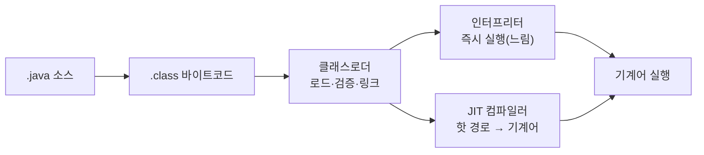

# JVM 위에서 실행된다는 것

> Java 코드는 OS에 직접 컴파일되지 않습니다. JVM이라는 가상 머신 위에서 실행됩니다. 이 한 가지 결정이 GC, 워밍업, Stop-the-World를 만들었습니다.

## 이게 없으면 무슨 일이 벌어지는가

배포 직후 5분간 응답이 느리다가 정상으로 돌아오는 현상. 로그에는 아무것도 없습니다.

GC로 인해 서비스가 수백 밀리초씩 멈추는 현상. "왜 가끔 튀지?" 질문에 답을 못 합니다.

Docker 이미지를 Alpine Linux로 바꿨더니 JNI 라이브러리가 작동하지 않는 현상. "JVM인데 왜 OS를 타냐?" 의문이 생깁니다.

이 세 현상은 전부 JVM이 "어떻게" 실행되는지 모르면 원인을 추론하기 어렵습니다.

## 어떻게 동작하는가

C/C++ 코드는 컴파일하면 특정 OS와 CPU 아키텍처에 맞는 기계어가 나옵니다. macOS ARM용 바이너리는 Linux x86에서 돌아가지 않습니다.

Java는 다릅니다. 컴파일하면 **바이트코드(.class)**가 나옵니다. 바이트코드는 OS가 직접 실행하지 않습니다. JVM이 읽고 실행합니다.

**클래스로더**는 `.class` 파일을 메모리에 올리고 JVM 명세에 맞는지 검증합니다.

처음에는 **인터프리터**가 바이트코드를 한 줄씩 해석해 실행합니다. 시작이 빠르지만 실행 속도는 느립니다.

JVM은 자주 실행되는 경로(핫 경로)를 감지하면 **JIT(Just-In-Time) 컴파일러**가 그 부분을 기계어로 컴파일해 캐시합니다. 시간이 지날수록 더 빨라집니다.

## 개발자에게 주는 것

**플랫폼 독립성.** `javac`로 한 번 컴파일한 `.class` 파일은 JVM이 있는 곳이라면 어디서든 실행됩니다. 빌드 파이프라인이 OS에 독립적입니다.

**자동 메모리 관리(GC).** `malloc`/`free`를 직접 호출하지 않아도 됩니다. GC가 더 이상 참조되지 않는 객체를 탐지하고 해제합니다.

**런타임 최적화.** JIT는 실행 중에 실제 사용 패턴을 보고 최적화합니다. 컴파일 시점에는 알 수 없는 정보, 즉 어떤 코드 경로가 실제로 자주 불리는지를 활용할 수 있습니다.

## 트레이드오프 — 개발자가 치르는 것

**워밍업 지연.** JIT가 핫 경로를 파악하고 컴파일하는 데 시간이 걸립니다. 그 전까지는 인터프리터 속도로 실행됩니다. 배포 직후에 느린 건 버그가 아니라 JVM의 정상 동작입니다. AWS Lambda처럼 인스턴스가 짧게 사는 환경에서는 항상 워밍업 단계에만 머물게 됩니다.

**Stop-the-World.** GC가 힙을 정리할 때 JVM의 모든 스레드가 잠시 멈춥니다. 이 시간이 수십 밀리초에서 수 초까지 늘어나면 타임아웃과 응답 지연으로 나타납니다.

**메모리 오버헤드.** JVM 자체, JIT 컴파일된 코드 캐시, 클래스 메타데이터가 추가 메모리를 씁니다. 같은 로직이라도 네이티브 언어보다 메모리 사용량이 높습니다. 컨테이너 메모리 리밋을 빡빡하게 잡으면 예상치 못한 OOMKill이 발생합니다.

**JNI를 쓰면 플랫폼 독립성이 깨집니다.** 네이티브 라이브러리(`.so`, `.dll`)를 써야 하는 순간 OS와 CPU 아키텍처에 종속됩니다. Alpine Linux(musl libc)와 Ubuntu(glibc)에서 JNI 라이브러리 호환성이 갈리는 이유가 여기 있습니다.

## 이것만은

1. Java는 OS가 아닌 JVM 위에서 실행됩니다. 이 구조 때문에 워밍업, GC, Stop-the-World가 존재합니다.
2. 배포 직후 느린 건 JIT가 아직 컴파일하지 않은 것이고, 가끔 수백ms가 튀는 건 GC Stop-the-World입니다.
3. "JVM이라 OS 무관"은 JNI 없을 때만 성립합니다.

## 더 읽기

- [JVM Technology Overview (Oracle Java 21)](https://docs.oracle.com/en/java/javase/21/vm/java-virtual-machine-technology-overview.html)
- `05-java/01-jvm-memory.md` — JVM이 쓰는 메모리 구조
- `05-java/03-gc-basics.md` — GC는 언제, 어떻게 작동하는가
