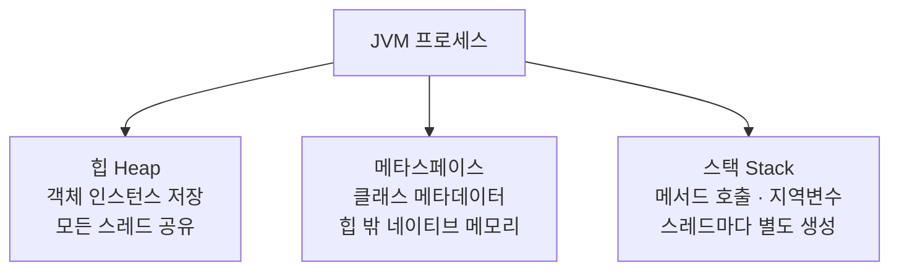

# JVM 메모리: 힙, 스택, 메타스페이스

## 1. 핵심 개념: 힙, 스택, 메타스페이스란?

- **힙(Heap)**: `new`로 만든 모든 객체 인스턴스가 저장됩니다. 모든 스레드가 공유합니다.
- **스택(Stack)**: 메서드 호출과 지역변수가 저장됩니다. 스레드마다 별도로 생성됩니다.
- **메타스페이스(Metaspace)**: 클래스 자체의 메타데이터(메서드 이름, 필드 타입, 바이트코드)가 저장됩니다.

> **OOM 에러 메시지 세 줄이 전혀 다른 원인을 가리킵니다.** `OutOfMemoryError: Java heap space`는 객체가 너무 많은 것이고, `OutOfMemoryError: Metaspace`는 클래스가 너무 많이 로드된 것이고, `StackOverflowError`는 재귀 호출이 너무 깊어진 것입니다. 이 구분을 모르면 스택 오버플로우가 났는데 `-Xmx`(힙 크기)를 늘리는 식으로 헛다리를 짚습니다.

## 2. 구조



- **힙**은 내부적으로 Young 영역과 Old 영역으로 나뉩니다. GC는 이 구분으로 단명 객체는 빠르게, 오래 사는 객체는 따로 관리합니다.
- **스택**은 메서드가 호출될 때마다 스택 프레임이 쌓이고, 메서드가 반환되면 사라집니다. 기본 타입(int, long, double)은 `new` 없이 스택에 직접 저장됩니다.
- **메타스페이스**는 Java 8 이전에는 PermGen이라는 이름으로 힙 안에 있었습니다. Java 8부터 힙 밖의 네이티브 메모리로 옮겨졌습니다.

### 2-1. 선택적 확장 지점

- 기본 동작은 JVM이 알아서 각 영역 크기를 정하는 것입니다.
- `-Xms`/`-Xmx`(힙), `-Xss`(스택), `-XX:MaxMetaspaceSize`(메타스페이스)로 각 영역의 크기를 직접 조정할 수 있습니다. 필수는 아니고 운영 환경에 맞춰 선택적으로 튜닝하는 지점입니다.

## 3. 흐름

### 3-1. 크기 설정

```bash
# 힙 최소 256MB, 최대 1GB
java -Xms256m -Xmx1g -jar app.jar
```

### 3-2. OOM 메시지로 원인 영역 특정하기

| 에러 메시지 | 원인 영역 | 가능성 높은 원인 |
|---|---|---|
| `OutOfMemoryError: Java heap space` | 힙 | 객체 누수, 대량 데이터 메모리 적재 |
| `OutOfMemoryError: Metaspace` | 메타스페이스 | 동적 클래스 생성 과다(리플렉션, CGLIB 프록시) |
| `OutOfMemoryError: GC overhead limit exceeded` | 힙 | GC가 회수할 객체가 없는데 계속 시도 |
| `StackOverflowError` | 스택 | 무한 재귀, 재귀 깊이 초과 |

## 4. 특징

### 4-1. 사용 시기

- 힙 크기 조정: 객체를 많이 다루는 배치·대량 데이터 처리 서비스
- 스택 크기 조정: 재귀 깊이가 깊은 알고리즘(트리 순회, 파서)을 다룰 때
- 메타스페이스 상한 설정: 동적 프록시·리플렉션을 많이 쓰는 프레임워크(Spring 등) 위에서 운영할 때

### 4-2. 장점

- 영역이 나뉘어 있어서 OOM 메시지만으로 어디가 문제인지 특정할 수 있습니다.
- 스택이 스레드마다 독립돼 있어 지역변수는 별도 동기화 없이 스레드 안전합니다.

### 4-3. 단점 / 트레이드오프

- 메타스페이스 상한을 걸지 않으면 클래스 누수가 있어도 시스템 메모리를 다 쓸 때까지 티가 안 납니다.
- 힙을 너무 크게 잡으면 GC가 정리할 대상이 늘어나 Stop-the-World 시간이 길어질 수 있습니다.

## 5. 예제: 재귀 깊이 제어

### 5-1. 클린하지 않은 코드 ❌

```java
// ❌ 종료 조건이 입력에 좌우되어, 깊은 트리에서 StackOverflowError가 난다
public int depth(TreeNode node) {
    if (node == null) return 0;
    return 1 + Math.max(depth(node.left), depth(node.right));
}
```

### 5-2. 반복문으로 전환한 코드 ✔️

```java
// ✅ 스택을 직접 관리하는 반복문 — 힙에 쌓이므로 스레드 스택 한계에 걸리지 않는다
public int depth(TreeNode root) {
    if (root == null) return 0;
    Deque<TreeNode> stack = new ArrayDeque<>();
    Map<TreeNode, Integer> depths = new HashMap<>();
    stack.push(root);
    depths.put(root, 1);
    int maxDepth = 1;
    while (!stack.isEmpty()) {
        TreeNode node = stack.pop();
        int d = depths.get(node);
        maxDepth = Math.max(maxDepth, d);
        if (node.left != null) { stack.push(node.left); depths.put(node.left, d + 1); }
        if (node.right != null) { stack.push(node.right); depths.put(node.right, d + 1); }
    }
    return maxDepth;
}
```

- 재귀는 호출마다 스택 프레임을 쌓지만, 반복문은 힙에 있는 자료구조(`Deque`)를 씁니다. 힙은 스택보다 훨씬 크기 때문에 깊이 제한에서 자유로워집니다.

## 6. 스레드별 스택 격리

- 스택이 스레드마다 독립적으로 생성되는 이유는 지역변수를 스레드 간 공유로부터 지키기 위해서입니다.

### 6-1. 격리를 활용하지 못한 코드 ❌

```java
public class Counter {
    private int count = 0; // 힙에 저장되는 인스턴스 필드 — 여러 스레드가 공유
    public void increment() {
        count++; // 여러 스레드가 동시에 호출하면 값이 꼬인다
    }
}
```

### 6-2. 스택의 격리를 활용한 코드 ✔️

```java
public int computeLocally(int input) {
    int localCount = 0; // 스택에 저장되는 지역변수 — 스레드마다 독립적
    for (int i = 0; i < input; i++) {
        localCount++;
    }
    return localCount; // 다른 스레드의 실행과 절대 간섭하지 않는다
}
```

- 힙에 있는 인스턴스 필드는 스레드 간에 공유되므로 동기화가 필요하지만, 스택에 있는 지역변수는 애초에 스레드마다 분리돼 있어 동기화가 필요 없습니다.

## 7. 확장 지점 응용하기 — 메타스페이스 상한

### 7-1. 클린하지 않은 코드 ❌

```bash
# ❌ 메타스페이스 무제한 — 클래스 누수가 있어도 시스템 메모리가 바닥날 때까지 티가 안 난다
java -jar app.jar
```

### 7-2. 상한을 지정한 코드 ✔️

```bash
# ✅ 상한을 걸어 문제를 조기에, 명확하게 재현한다
java -XX:MaxMetaspaceSize=256m -jar app.jar
```

- Spring은 AOP 프록시(CGLIB), JPA 엔티티 바이트코드 강화 등을 위해 런타임에 클래스를 동적으로 만들어냅니다. 상한이 없으면 이 클래스들이 계속 쌓여도 알아채기 어렵습니다.

## 8. 실무에서 찾아보는 JVM 메모리 진단 도구

- `java.lang.management.MemoryMXBean` — 힙/논힙 사용량을 코드에서 직접 조회할 수 있는 JMX 표준 API입니다.
- Spring Boot Actuator의 `/actuator/metrics/jvm.memory.used` — 위 정보를 HTTP 엔드포인트로 노출합니다.
- `-XX:+HeapDumpOnOutOfMemoryError` — OOM 발생 시 자동으로 힙 덤프를 남겨 사후 분석을 가능하게 합니다.

```bash
# OOM 발생 시 자동으로 힙 덤프 생성 — 프로덕션에 기본으로 붙여둡니다
java -XX:+HeapDumpOnOutOfMemoryError \
     -XX:HeapDumpPath=/var/log/heapdump.hprof \
     -jar app.jar
```

## 9. 관련된 개념과 비교

### 9-1. 메타스페이스 VS PermGen(Java 7 이하)

**유사점**

- 둘 다 클래스 메타데이터를 저장하는 영역입니다.

**차이점**

- PermGen은 힙 안에 있어 힙 크기 설정(`-Xmx`)의 영향을 받았고, 크기가 고정적이라 OOM이 잦았습니다.
- 메타스페이스는 힙 밖의 네이티브 메모리를 씁니다. 기본적으로 OS가 허용하는 만큼 늘어나며, `-XX:MaxMetaspaceSize`로 별도 제한을 걸어야 합니다.

## 10. 함정

**`StackOverflowError`가 나서 `-Xmx`를 늘린다**

- **증상**: `StackOverflowError`가 반복 발생합니다.
- **원인**: 스택 오버플로우는 힙 부족이 아닙니다. 재귀 호출이 너무 깊어져 스레드 스택이 가득 찬 것입니다. `-Xmx`는 힙 크기 옵션이라 스택에는 영향이 없습니다.
- **해법**: 재귀 종료 조건을 먼저 확인하고, 반복문으로 전환하는 것이 근본 해결책입니다(5장 참고). 스택 크기 자체를 늘리려면 `-Xss2m` 같은 옵션을 쓰지만, 무한 재귀가 원인이라면 임시방편입니다.

**Spring Boot에서 메타스페이스 OOM이 발생한다**

- **증상**: `OutOfMemoryError: Metaspace`. 장기 운영 후 또는 배포 직후에 발생합니다.
- **원인**: AOP 프록시, JPA 엔티티 바이트코드 강화, 람다 클래스 생성 등으로 런타임에 동적으로 만들어진 클래스가 메타스페이스에 쌓입니다. 클래스로더 자체가 해제되지 않으면 클래스도 해제되지 않습니다.
- **해법**: `-XX:MaxMetaspaceSize=256m`으로 상한을 걸어 문제를 먼저 재현합니다. 힙 덤프로 어떤 클래스로더가 클래스를 계속 생성하는지 찾습니다. `spring-boot-devtools`는 클래스로더를 재생성하는 구조라 프로덕션에서 쓰면 누수가 생깁니다.

⚠️ `OutOfMemoryError`가 나면 JVM은 추가 작업을 거의 못 합니다. 힙 덤프 생성도 실패할 수 있어 `-XX:+HeapDumpOnOutOfMemoryError`를 미리 설정해둡니다.

## 11. 참고자료

- [GC Tuning Guide (Oracle Java 21)](https://docs.oracle.com/en/java/javase/21/gctuning/introduction-garbage-collection-tuning.html)
- `05-java/00-jvm-why.md` — JVM이 애초에 왜 존재하는가
- `05-java/02-reading-oom.md` — 힙 덤프를 실제로 읽는 법
- `05-java/03-gc-basics.md` — GC가 힙을 어떻게 정리하는가
