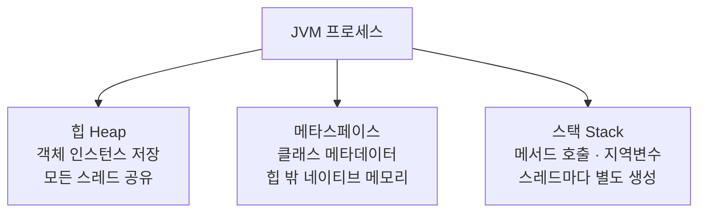

# JVM 메모리: 힙, 스택, 메타스페이스

> OOM이 발생하면 에러 메시지에 어느 영역에서 났는지 적혀 있습니다. 영역을 모르면 메시지를 읽어도 원인을 못 찾습니다.

## 이게 없으면 무슨 일이 벌어지는가

```
java.lang.OutOfMemoryError: Java heap space
java.lang.OutOfMemoryError: Metaspace
java.lang.StackOverflowError
```

세 줄이 전혀 다른 원인을 가리킵니다. 힙 OOM은 객체가 너무 많은 것이고, 메타스페이스 OOM은 클래스가 너무 많이 로드된 것이고, 스택 오버플로우는 재귀 호출이 너무 깊어진 것입니다.

이 구분을 모르면 스택 오버플로우가 났는데 `-Xmx`(힙 크기)를 늘리거나, 메타스페이스 OOM이 났는데 애플리케이션 재시작만 반복합니다. 둘 다 근본 원인을 건드리지 않습니다.

## JVM 메모리 구조



## 각 영역이 하는 일

### 힙 (Heap)

`new`로 만들어진 모든 객체가 저장됩니다. `OrderService`, `User`, `List<String>` 인스턴스 — 전부 힙입니다.

힙은 내부적으로 **Young 영역**과 **Old 영역**으로 나뉩니다. GC는 이 구분을 이용해 단명 객체는 빠르게, 오래 사는 객체(캐시, 세션)는 따로 관리합니다.

`-Xms`(초기 힙 크기)와 `-Xmx`(최대 힙 크기)로 크기를 설정합니다.

```bash
# 힙 최소 256MB, 최대 1GB
java -Xms256m -Xmx1g -jar app.jar
```

### 스택 (Stack)

스레드마다 하나씩 만들어집니다. 메서드가 호출될 때마다 **스택 프레임**이 쌓이고, 메서드가 반환되면 사라집니다.

스택 프레임에는 지역변수(`int count = 0`), 메서드 파라미터, 반환 주소가 들어 있습니다. `new`로 만들지 않은 기본 타입(int, long, double)은 힙이 아닌 스택에 직접 저장됩니다.

스택이 가득 차면 `StackOverflowError`가 발생합니다. 무한 재귀가 가장 흔한 원인입니다.

### 메타스페이스 (Metaspace)

클래스 자체에 대한 정보(메서드 이름, 필드 타입, 바이트코드)가 저장됩니다. `OrderService.class`를 클래스로더가 로드하면 그 메타데이터가 이곳에 들어옵니다.

Java 8 이전에는 이 영역이 **PermGen(영구 세대)**이라는 이름으로 힙 안에 있었습니다. Java 8부터 힙 밖의 네이티브 메모리로 옮기고 메타스페이스로 이름을 바꿨습니다. `-XX:MaxMetaspaceSize`로 제한하지 않으면 OS가 허용하는 만큼 늘어납니다.

## 실무에서는 — OOM 메시지로 원인 찾기

에러 메시지만 보면 어느 영역 문제인지 특정할 수 있습니다.

| 에러 메시지 | 원인 영역 | 가능성 높은 원인 |
|---|---|---|
| `OutOfMemoryError: Java heap space` | 힙 | 객체 누수, 대량 데이터 메모리 적재 |
| `OutOfMemoryError: Metaspace` | 메타스페이스 | 동적 클래스 생성 과다(리플렉션, CGLIB 프록시) |
| `OutOfMemoryError: GC overhead limit exceeded` | 힙 | GC가 회수할 객체가 없는데 계속 시도 — 힙 부족과 동일 |
| `StackOverflowError` | 스택 | 무한 재귀, 재귀 깊이 초과 |

힙 OOM이 발생하면 힙 덤프가 원인 분석의 시작점입니다. 미리 설정해두지 않으면 OOM 시점의 스냅샷을 얻기가 어렵습니다.

```bash
# OOM 발생 시 자동으로 힙 덤프 생성 — 프로덕션에 기본으로 붙여둡니다
java -XX:+HeapDumpOnOutOfMemoryError \
     -XX:HeapDumpPath=/var/log/heapdump.hprof \
     -jar app.jar
```

## 함정

**`StackOverflowError`가 나서 `-Xmx`를 늘린다**

- **증상**: `StackOverflowError`가 반복 발생합니다.
- **원인**: 스택 오버플로우는 힙 부족이 아닙니다. 재귀 호출이 너무 깊어져서 스레드 스택이 가득 찬 것입니다. `-Xmx`는 힙 크기를 조정하는 옵션이므로 스택에 아무 영향이 없습니다.
- **해법**: 재귀 종료 조건이 제대로 걸려 있는지 먼저 확인합니다. 재귀를 반복문으로 전환하는 것이 근본 해결책입니다. 스택 크기를 늘리고 싶다면 `-Xss2m` 같은 옵션을 씁니다. 단, 무한 재귀가 원인이라면 크기 조정은 임시방편입니다.

**Spring Boot에서 메타스페이스 OOM이 발생한다**

- **증상**: `OutOfMemoryError: Metaspace`. 장기 운영 후 또는 배포 직후에 발생합니다.
- **원인**: Spring은 AOP 프록시(CGLIB), JPA 엔티티 바이트코드 강화, 람다 클래스 생성 등을 위해 런타임에 클래스를 동적으로 만들어냅니다. 이 클래스들이 메타스페이스에 쌓입니다. 클래스로더 자체가 해제되지 않으면 클래스도 해제되지 않습니다.
- **해법**: `-XX:MaxMetaspaceSize=256m`으로 상한을 걸어 문제를 먼저 재현합니다. 힙 덤프를 분석해 어떤 클래스로더가 클래스를 계속 생성하는지 찾습니다. `spring-boot-devtools`는 클래스로더를 재생성하는 구조라 프로덕션에서 쓰면 누수가 생깁니다.

⚠️ `OutOfMemoryError`가 나면 JVM은 메모리 부족 상태에서 추가 작업을 거의 못 합니다. 힙 덤프 생성도 실패할 수 있습니다. `-XX:+HeapDumpOnOutOfMemoryError`를 미리 설정해두는 이유입니다.

## 이것만은

1. JVM 메모리는 힙(객체), 스택(메서드 호출·지역변수), 메타스페이스(클래스 정보) 세 영역입니다.
2. OOM 에러 메시지가 어느 영역에서 났는지 알려줍니다. `StackOverflowError`에 `-Xmx`는 효과가 없습니다.
3. 프로덕션 JVM에 `-XX:+HeapDumpOnOutOfMemoryError`를 붙여두면 힙 OOM 원인 분석 시간이 크게 줄어듭니다.

## 더 읽기

- [GC Tuning Guide (Oracle Java 21)](https://docs.oracle.com/en/java/javase/21/gctuning/introduction-garbage-collection-tuning.html)
- `05-java/02-reading-oom.md` — 힙 덤프를 실제로 읽는 법
- `05-java/03-gc-basics.md` — GC가 힙을 어떻게 정리하는가
