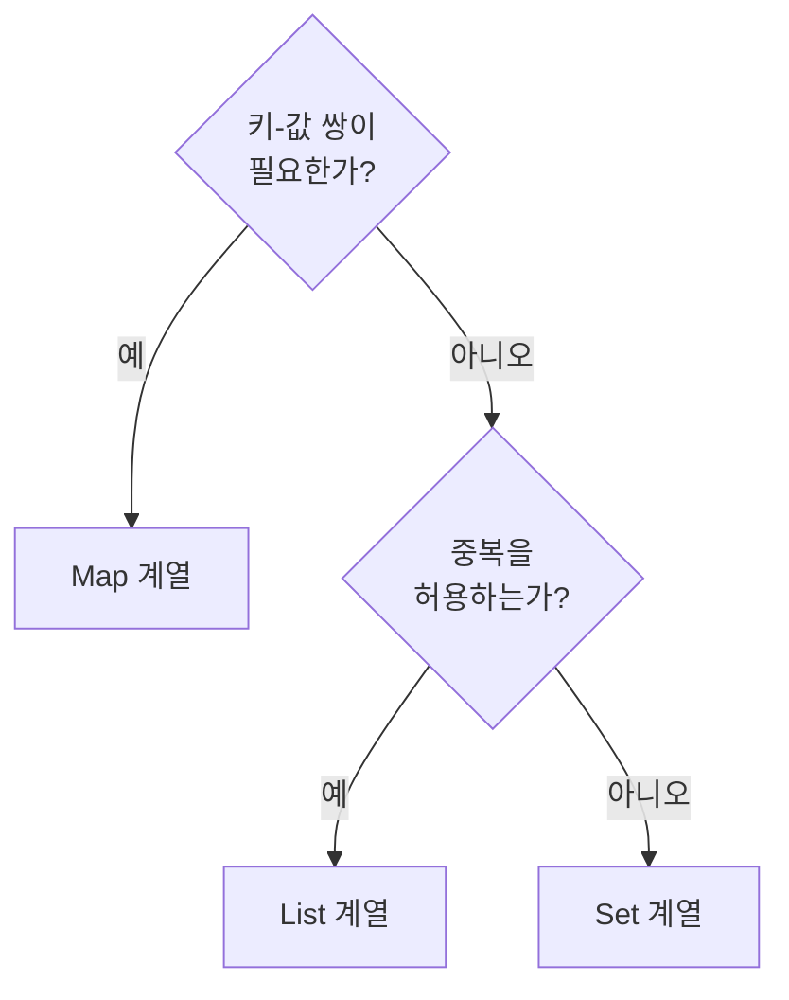

# List, Set, Map — 언제 무엇을 쓰는가

> 자료구조 선택은 "동작하는가"가 아니라 "얼마나 빠른가"를 결정합니다. `ArrayList`로 중복 체크를 하면 O(n), `HashSet`이면 O(1)입니다.

## 이게 없으면 무슨 일이 벌어지는가

주문 ID 중복 여부를 `ArrayList.contains()`로 체크하는 코드. 주문이 1000건이면 최대 1000번 비교, 10만 건이면 10만 번 비교입니다. 데이터가 늘어날수록 응답 시간이 선형으로 증가합니다.

`HashMap`에서 키를 순서대로 꺼낼 수 있다는 가정으로 API 응답을 만들다가, 환경에 따라 순서가 달라지는 버그.

`HashSet`에 넣은 객체를 `contains()`로 찾지 못하는 현상. `equals()`와 `hashCode()`를 오버라이드하지 않아서 생기는 일입니다.

## 언제 무엇을 쓰는가



## List — 순서가 있고 중복을 허용할 때

인덱스로 접근하거나, 순서가 의미 있는 데이터를 담을 때 씁니다.

**`ArrayList`를 기본으로 씁니다.** 내부가 배열이라 인덱스 접근이 O(1)이고, CPU 캐시에 연속으로 올라와 실제 처리 속도가 빠릅니다.

**`LinkedList`는 거의 쓸 일이 없습니다.** "중간 삽입이 O(1)이라 빠르다"는 말이 있지만, 노드가 힙 여기저기 흩어져 있어 캐시 미스가 많이 발생합니다. 실제 벤치마크에서 대부분의 경우 `ArrayList`가 더 빠릅니다. 맨 앞에 빈번하게 삽입하는 게 아니라면 `ArrayList`를 씁니다.

```java
// ✅ 기본값
List<OrderId> orderIds = new ArrayList<>();

// ❌ 특별한 이유 없이 LinkedList
List<OrderId> orderIds = new LinkedList<>();
```

## Set — 중복이 없어야 할 때

`contains()`, `add()` 모두 O(1)인 `HashSet`이 기본입니다.

| 구현체 | 특징 | 선택 기준 |
|---|---|---|
| `HashSet` | O(1) 탐색·삽입 | 기본값 |
| `LinkedHashSet` | 삽입 순서 유지 | 순서가 필요할 때 |
| `TreeSet` | 정렬 순서 유지, O(log n) | 항상 정렬된 상태가 필요할 때 |

```java
// 중복 제거 + 순서 유지가 필요할 때
Set<String> tags = new LinkedHashSet<>();
tags.add("java");
tags.add("spring");
tags.add("java");  // 무시됨, 순서는 삽입 순서대로 유지
```

## Map — 키로 값을 찾아야 할 때

| 구현체 | 특징 | 선택 기준 |
|---|---|---|
| `HashMap` | O(1) 탐색·삽입, 순서 없음 | 기본값 |
| `LinkedHashMap` | 삽입 순서 유지 | API 응답 JSON 순서를 고정할 때 |
| `TreeMap` | 키 정렬 순서 유지, O(log n) | 키를 정렬된 순서로 순회할 때 |
| `ConcurrentHashMap` | 스레드 안전 | 여러 스레드가 동시에 읽고 쓸 때 |

`HashMap`은 **삽입 순서를 보장하지 않습니다.** 작은 데이터에서는 우연히 순서가 맞아 보여도, 데이터가 늘거나 Java 버전이 바뀌면 달라집니다. 순서가 필요하면 `LinkedHashMap`을 명시적으로 씁니다.

```java
// ✅ 응답 JSON 키 순서를 고정해야 할 때
Map<String, Object> response = new LinkedHashMap<>();
response.put("userId", 1L);
response.put("name", "홍길동");
response.put("email", "hong@example.com");
```

## 함정

**`ArrayList.contains()`를 루프 안에서 반복 호출한다**

- **증상**: 중복 여부 체크 로직이 데이터 증가에 따라 급격히 느려집니다.
- **원인**: `ArrayList.contains()`는 처음부터 끝까지 선형 탐색합니다. O(n). 루프 안에서 부르면 O(n²)입니다.
- **해법**: 중복 체크가 목적이라면 `HashSet`을 씁니다. 기존 `List`를 체크용으로만 쓴다면 `new HashSet<>(list)`로 변환합니다.

```java
// ❌ O(n²) — processedIds가 크면 느립니다
List<Long> processedIds = new ArrayList<>();
for (Order order : orders) {
    if (!processedIds.contains(order.getId())) {
        processedIds.add(order.getId());
        process(order);
    }
}

// ✅ O(n) — contains()가 O(1)
Set<Long> processedIds = new HashSet<>();
for (Order order : orders) {
    if (processedIds.add(order.getId())) {  // add()가 false면 이미 존재
        process(order);
    }
}
```

**`HashSet`/`HashMap`에 넣었는데 `contains()`가 false를 반환한다**

- **증상**: `set.add(obj)` 후 `set.contains(obj)`가 `false`입니다.
- **원인**: `HashSet`은 `hashCode()`로 버킷을 찾고, `equals()`로 동일성을 판단합니다. 둘 중 하나라도 오버라이드하지 않으면 Object 기본 구현(참조 동등성)을 씁니다. 같은 값이어도 참조가 다르면 다른 객체로 취급합니다.
- **해법**: 값 동등성이 필요한 객체는 `equals()`와 `hashCode()`를 함께 오버라이드합니다. Lombok `@EqualsAndHashCode` 또는 Java record가 자동으로 생성해줍니다.

```java
// ❌ equals/hashCode 없음 — 참조가 달라서 찾지 못함
class OrderId {
    private final long id;
    public OrderId(long id) { this.id = id; }
}

Set<OrderId> seen = new HashSet<>();
seen.add(new OrderId(1L));
seen.contains(new OrderId(1L));  // false!

// ✅ record — equals/hashCode 자동 생성
record OrderId(long id) {}

Set<OrderId> seen = new HashSet<>();
seen.add(new OrderId(1L));
seen.contains(new OrderId(1L));  // true
```

## 이것만은

1. 중복 체크나 존재 여부 확인이 목적이면 `List` 말고 `Set`이나 `Map`을 씁니다. `contains()`가 O(1)입니다.
2. `HashMap`은 순서를 보장하지 않습니다. 순서가 필요하면 `LinkedHashMap`을 씁니다.
3. `HashSet`/`HashMap`에 커스텀 객체를 키로 쓴다면 `equals()`와 `hashCode()`를 반드시 오버라이드합니다.

## 더 읽기

- [Java Collections API (Oracle Java 21)](https://docs.oracle.com/en/java/javase/21/docs/api/java.base/java/util/Collection.html)
- `05-java/11-equals-hashcode.md` — `equals`·`hashCode` 계약과 컬렉션에서 객체가 사라지는 이유
- `05-java/08-concurrent-collections.md` — 멀티스레드 환경에서 컬렉션 쓰기
