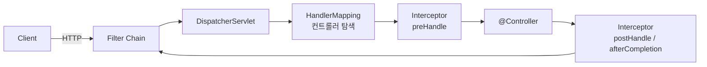

# HTTP 요청 한 개가 내 코드에 닿기까지

> 요청이 Tomcat 소켓에 들어온 순간부터 `@Controller` 메서드가 호출되기까지 거치는 단계와 각 단계의 역할.

## 이게 없으면 무슨 일이 벌어지는가

"인증 로직을 어디에 두어야 하지?" — 이 질문에 확신이 없으면 Filter, Interceptor, AOP 중 아무 데나 넣게 됩니다.

결과:
- Filter에서 `@Autowired` 빈을 주입하려다 null이 나옴
- Interceptor가 정적 리소스 요청에도 실행되는 줄 알고 불필요한 예외 처리를 추가
- AOP로 HTTP 헤더를 읽으려다 `HttpServletRequest`를 어떻게 꺼내는지 한참 검색

이 세 단계가 어디에 위치하는지 알면 어디에 무엇을 두어야 하는지가 자명해집니다.

## 어떻게 동작하는가



**Filter Chain**: `jakarta.servlet.Filter`를 구현합니다. Tomcat이 직접 실행하며 DispatcherServlet보다 앞에 있습니다. Spring Context가 뜨기 전에도 동작합니다.

**DispatcherServlet**: Spring MVC의 프론트 컨트롤러입니다. 모든 요청을 받아 `HandlerMapping`에게 "이 URL은 누가 처리하는가" 물어봅니다.

**HandlerInterceptor**: Spring MVC 레벨입니다. `preHandle()`은 컨트롤러 실행 전, `postHandle()`은 정상 응답 후, `afterCompletion()`은 예외 여부와 무관하게 응답이 나간 뒤 항상 실행됩니다.

**HandlerAdapter**: 컨트롤러 메서드를 실제로 호출하는 객체입니다. `@RequestBody` 역직렬화, `@PathVariable` 바인딩이 여기서 일어납니다.

## 실무에서는

**Filter에 두는 것**: 요청/응답 바이트를 직접 다뤄야 하거나, Spring이 뜨기 전에 처리해야 할 때입니다.
- CORS 헤더 추가
- 요청 본문 전체 로깅 (`ContentCachingRequestWrapper` 활용)
- gzip 압축/해제
- JWT 문자열 추출 (파싱은 Spring Bean인 서비스에서)

**Interceptor에 두는 것**: Spring Bean이 필요하면서 HTTP 요청/응답 수준의 전후처리가 필요할 때입니다.
- 토큰 검증 후 인증 객체를 `SecurityContextHolder`에 세팅
- API 응답 시간 측정

**AOP에 두는 것**: HTTP와 무관한 비즈니스 메서드 전후처리입니다.
- `@Transactional` (Spring 내장)
- `@Cacheable`
- 특정 서비스 메서드의 실행 시간 측정

```java
// Filter 예시
@Component
public class RequestLoggingFilter extends OncePerRequestFilter {
    @Override
    protected void doFilterInternal(HttpServletRequest request,
                                    HttpServletResponse response,
                                    FilterChain chain) throws IOException, ServletException {
        log.info("요청: {} {}", request.getMethod(), request.getRequestURI());
        chain.doFilter(request, response);
        log.info("응답: {}", response.getStatus());
    }
}
```

```java
// Interceptor 예시 — WebMvcConfigurer에 addInterceptors()로 등록해야 합니다
@Component
public class AuthInterceptor implements HandlerInterceptor {
    private final TokenService tokenService;

    @Override
    public boolean preHandle(HttpServletRequest request,
                             HttpServletResponse response,
                             Object handler) throws Exception {
        String token = request.getHeader("Authorization");
        if (!tokenService.isValid(token)) {
            response.setStatus(HttpServletResponse.SC_UNAUTHORIZED);
            return false; // false 반환 시 컨트롤러를 호출하지 않습니다
        }
        return true;
    }
}
```

## 함정

**Filter가 같은 요청에 두 번 실행된다**

- **증상**: 로그가 두 번 찍히거나 인증이 두 번 수행됩니다.
- **원인**: `RequestDispatcher.forward()`를 쓰면 Servlet Container가 Filter Chain을 처음부터 다시 통과시킵니다. Spring MVC 내부에서 예외 처리 시 `/error`로 forward가 발생합니다.
- **해법**: `Filter` 대신 `OncePerRequestFilter`를 상속하세요. 요청별로 한 번만 실행되도록 내부에서 처리합니다.

**Filter에서 요청 본문을 읽으면 Controller가 빈 body를 받는다**

- **증상**: 로깅 Filter에서 `request.getInputStream()`을 읽은 뒤 `@RequestBody`가 항상 비어 있습니다.
- **원인**: `InputStream`은 한 번 읽으면 커서가 끝으로 이동해 다시 읽을 수 없습니다.
- **해법**: `ContentCachingRequestWrapper`로 요청을 감싸면 본문을 여러 번 읽을 수 있습니다. 단, body는 `chain.doFilter()`가 실행된 뒤에 읽어야 캐시에 값이 채워집니다.

```java
@Override
protected void doFilterInternal(HttpServletRequest request,
                                HttpServletResponse response,
                                FilterChain chain) throws IOException, ServletException {
    ContentCachingRequestWrapper wrappedRequest = new ContentCachingRequestWrapper(request);
    chain.doFilter(wrappedRequest, response);
    // doFilter 이후에 읽어야 합니다
    String body = new String(wrappedRequest.getContentAsByteArray(),
                             wrappedRequest.getCharacterEncoding());
    log.info("요청 본문: {}", body);
}
```

**`postHandle`은 예외 발생 시 실행되지 않는다**

- **증상**: `postHandle`에서 응답 로그를 찍으려는데, 예외가 발생한 요청만 기록이 빠집니다.
- **원인**: DispatcherServlet은 예외가 발생하면 `postHandle`을 건너뜁니다.
- **해법**: "무슨 일이 있어도 실행돼야 한다"면 `afterCompletion`에 두세요. 예외 발생 시에도 항상 실행됩니다.

## 이것만은

1. Filter는 Servlet Container 레벨(Spring 밖), Interceptor는 Spring MVC 레벨(DispatcherServlet 안), AOP는 Bean 메서드 레벨입니다.
2. 요청/응답 바이트를 건드려야 하면 Filter, Spring Bean이 필요한 전후처리면 Interceptor입니다.
3. Interceptor의 `afterCompletion`은 예외가 나도 실행되지만, `postHandle`은 예외 발생 시 건너뜁니다.

## 더 읽기

- [Spring MVC DispatcherServlet 공식 문서](https://docs.spring.io/spring-framework/reference/web/webmvc/mvc-servlet.html)
- `06-spring/14-dispatcher-servlet.md` — DispatcherServlet이 요청을 처리하는 더 자세한 흐름
- `06-spring/15-filter-interceptor-aop.md` — 세 가지의 경계를 더 깊게
