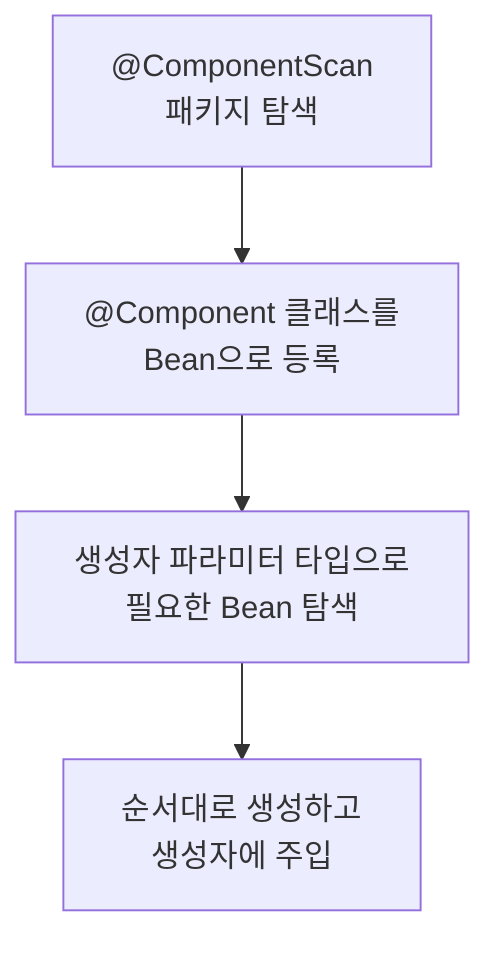

# 의존성 주입은 무슨 문제를 푸는가

> `new`로 객체를 만드는 것과 주입받는 것의 차이는 "누가 객체를 만드느냐"입니다.

## 이게 없으면 무슨 일이 벌어지는가

`new`로 직접 의존 객체를 만들면 세 가지 문제가 생깁니다.

**교체가 불가능합니다.** 테스트에서 실제 DB 대신 가짜 객체를 넣고 싶어도, 코드에 구현체가 박혀 있으면 교체할 방법이 없습니다.

```java
public class OrderService {
    // ❌ 구현체가 코드에 박혔다. 테스트에서 교체 불가
    private final UserRepository userRepository = new JpaUserRepository();
}
```

**공유가 어렵습니다.** `OrderService`와 `PaymentService` 둘 다 같은 `UserRepository` 인스턴스를 써야 한다면, 직접 만들 때는 싱글톤 패턴을 직접 구현해야 합니다.

**생명주기 관리 코드가 비즈니스 코드에 섞입니다.** 커넥션 풀을 열고 닫는 코드가 서비스 로직 안에 들어옵니다.

## 핵심 개념

**IoC (Inversion of Control)**: 객체를 만들고 연결하는 제어권을 코드 대신 컨테이너에 넘기는 것입니다.

**DI (Dependency Injection)**: IoC를 구현하는 방법 중 하나입니다. 필요한 객체를 외부에서 밀어넣어 줍니다.

## 어떻게 동작하는가

Spring Boot 애플리케이션이 시작할 때 `ApplicationContext`가 이 과정을 수행합니다.



`@Service`, `@Repository`, `@Controller`는 전부 `@Component`의 별칭입니다. 어떤 게 붙었든 Spring이 인식하고 Bean으로 등록합니다.

## 실무에서는

주입 방식은 세 가지인데, **생성자 주입만 씁니다.**

```java
// ✅ 생성자 주입
@Service
public class OrderService {
    private final UserRepository userRepository;
    private final PaymentClient paymentClient;

    public OrderService(UserRepository userRepository, PaymentClient paymentClient) {
        this.userRepository = userRepository;
        this.paymentClient = paymentClient;
    }
}
```

```java
// ❌ 필드 주입 — 쓰지 않습니다
@Service
public class OrderService {
    @Autowired
    private UserRepository userRepository;
}
```

생성자 주입을 써야 하는 이유 네 가지입니다.

**1. 필수 의존성이 명시됩니다.** 생성자 파라미터에 있으면 없을 수가 없습니다. 필드 주입은 Bean이 없어도 `null`인 채로 시작할 수 있습니다.

**2. 순환 참조를 시작 시점에 잡아줍니다.** (함정 섹션 참조)

**3. `final`로 선언할 수 있습니다.** 빈이 생성된 뒤에 의존 객체가 바뀌지 않는다는 게 보장됩니다.

**4. Spring 없이 테스트를 만들 수 있습니다.**

```java
// Spring Context 없이 단위 테스트 작성 가능
@Test
void 존재하지_않는_사용자_주문시_예외() {
    UserRepository fakeRepo = new FakeUserRepository();
    PaymentClient fakePayment = new FakePaymentClient();
    OrderService orderService = new OrderService(fakeRepo, fakePayment);

    assertThrows(UserNotFoundException.class, () -> orderService.order(-1L));
}
```

Lombok을 쓴다면 `@RequiredArgsConstructor`로 생성자 코드를 생략할 수 있습니다.

```java
@Service
@RequiredArgsConstructor
public class OrderService {
    private final UserRepository userRepository;
    private final PaymentClient paymentClient;
    // 생성자는 Lombok이 만들어 줍니다
}
```

## 함정

**순환 참조가 생성자 주입에서 애플리케이션 시작 시 터진다**

- **증상**: `BeanCurrentlyInCreationException`. 앱이 아예 뜨지 않습니다.
- **원인**: `A`가 `B`를 필요로 하고, `B`가 `A`를 필요로 하면 Spring이 어느 쪽도 먼저 만들지 못합니다. 생성자 주입은 이걸 시작 시점에 감지합니다.
- **해법**: 터지는 게 맞습니다. 순환 참조는 설계 문제입니다. 두 클래스가 서로를 참조해야 한다면, 그 로직을 담을 세 번째 클래스를 만들거나 이벤트로 결합을 끊어야 합니다.

⚠️ 필드 주입은 순환 참조가 있어도 시작은 됩니다. Spring Boot 2.6부터 기본으로 금지하지만, 이전 버전에서는 조용히 통과하고 런타임에 문제가 생깁니다. 생성자 주입이 이 문제를 먼저 드러내 줍니다.

**`@Autowired(required = false)`로 설정하면 `NullPointerException`이 숨는다**

- **증상**: 특정 조건에서 서비스 메서드 호출 시 `NullPointerException`이 발생합니다.
- **원인**: `required = false`이면 해당 타입의 Bean이 없어도 `null`이 주입됩니다. Bean 없음을 예외로 알아야 할 상황에 조용히 `null`이 들어옵니다.
- **해법**: 선택적 의존성이 진짜 필요하다면 `Optional<T>`로 명시합니다.

```java
// ❌ null이 들어와도 알 수 없다
@Autowired(required = false)
private SlackClient slackClient;

// ✅ 선택적 의존성임이 코드에서 드러난다
private final Optional<SlackClient> slackClient;
```

## 트레이드오프

DI 컨테이너를 도입하면 **코드가 Spring에 묶입니다.** `@Service`, `@Autowired` 같은 애노테이션이 들어오는 순간 순수 Java 클래스가 아닙니다.

이게 문제가 되는 경우는 Spring을 쓸 이유가 없는 작은 CLI 툴이나 라이브러리입니다. 이런 경우에는 `main()`에서 직접 `new`로 만드는 게 낫습니다.

Spring을 쓰기로 했다면 이 비용은 이미 낸 겁니다. 생성자 주입을 쓰면 Spring 없이도 단위 테스트를 작성할 수 있어서 결합도는 최소화됩니다.

## 이것만은

1. DI는 "누가 객체를 만드느냐"를 코드에서 컨테이너로 옮기는 것입니다. 목적은 교체 가능성과 생명주기 관리입니다.
2. 생성자 주입을 쓰면 `new OrderService(fakeRepo, fakeClient)`로 Spring 없이 테스트를 만들 수 있습니다.
3. 순환 참조가 생성자 주입에서 시작 시 터진다면, 설계를 고쳐야 한다는 신호입니다.

## 더 읽기

- [Spring IoC Container 공식 문서](https://docs.spring.io/spring-framework/reference/core/beans/dependencies/factory-collaborators.html)
- `06-spring/02-bean-lifecycle.md` — Bean은 언제 만들어지고 언제 죽는가
- `06-spring/03-circular-reference.md` — 순환 참조가 알려주는 설계 문제
