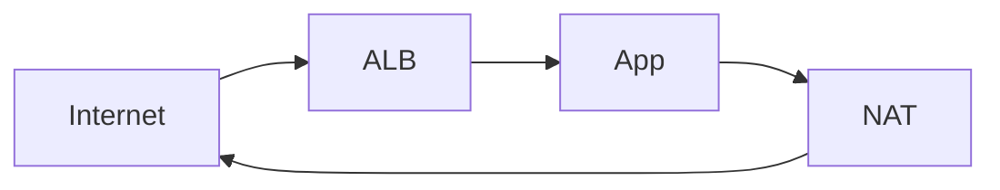

# 실무 백엔드 개념서 — 집필 지침서

> 이 문서는 **에이전트 작업 명령서**이자 **책의 편집 가이드**입니다.
> Claude 세션을 시작할 때 항상 이 파일을 먼저 읽고 작업합니다.

---

## 0. 이 문서의 사용법

**에이전트에게:**

1. 모든 작업 시작 전 이 문서를 읽는다.
2. 작업 중 판단이 필요하면 이 문서의 원칙을 근거로 결정하고, **어떤 원칙을 적용했는지 밝힌다.**
3. 이 문서로 결정할 수 없는 문제는 **추측해서 진행하지 말고 물어본다.**

**규칙 우선순위** (충돌 시)

```
사용자의 즉석 지시  >  이 문서  >  일반적 관행
```

단, `§13 금지 목록`은 사용자가 명시적으로 해제하기 전까지 즉석 지시보다도 우선합니다. (실수로 품질이 무너지는 걸 막는 안전장치)

**이 문서 자체의 변경**: 원칙이 현실과 안 맞으면 문서를 고칩니다. 다만 에이전트가 임의로 수정하지 않고, 문제를 보고하고 승인을 받습니다.

---

## 1. 프로젝트 정의

### 목표

> **실무에서 판단을 내려야 할 때 다시 펼쳐보게 되는 개념서.**

키워드는 **판단**입니다. "이게 뭔가요"에 답하는 문서가 아니라, "이 상황에서 뭘 골라야 하나요"에 답하는 문서입니다.

### 성공 기준

- 6개월 뒤 내가 다시 읽었을 때, 그때의 판단 근거가 복원된다
- 처음 보는 사람이 읽고 **왜 이 기술이 존재하는지** 말할 수 있다
- 챗봇에 물어보면 나오는 답보다 나은 게 하나라도 있다

### Non-goals (이 책이 **아닌** 것)

명시적으로 배제합니다. 이걸 안 정하면 문서가 무한히 팽창합니다.

| 아님 | 이유 |
|---|---|
| 튜토리얼 / 설치 가이드 | 공식 문서가 더 정확하고 최신 |
| API 레퍼런스 | 검색이 이김 |
| 자격증 대비서 | 시험 범위는 실무 범위가 아님 |

---

## 2. 독자

**두 명의 독자를 동시에 상정합니다.**

### 독자 A — 3년 뒤의 나

- 기본적인 지식은 있음
- 기본 문법 설명은 필요 없음
- 급함. 장애 중에 열어볼 수도 있음

### 독자 B — 공개 독자 (신입 ~ 주니어 백엔드 개발자, 0~3년차)

**이미 아는 것** (설명하지 말 것)
- 프로그래밍 기본 (변수, 반복문, 조건문)
- Java 문법 기초, Spring으로 CRUD 한 번 이상 만들어봄
- SQL 기본 쿼리 (SELECT, JOIN, GROUP BY)
- Git 기본 사용법
- AWS EC2로 간단한 배포 

**모르는 것** (여기가 본론)
- 왜 이 구조를 선택하는지, 왜 이 기술을 선택하는지, 언제 무너지는지
- 코드는 돌아가는데 프로덕션에서 터지는 이유
- 기술 간 트레이드오프 — 어떤 상황에서 무엇을 골라야 하는가
- 스택트레이스·로그·실행계획을 보고 원인을 찾는 법

### 이 문장이 나오면 실패

- ❌ "변수란 값을 저장하는 공간입니다"
- ❌ "Spring Boot는 Spring을 쉽게 쓰게 해주는 프레임워크입니다"
- ✅ "`@Transactional`이 프록시 기반이라 같은 클래스 내부 호출에서는 동작하지 않습니다. 이걸 모르면 롤백이 안 되는데 원인을 못 찾습니다."

---

## 3. 콘텐츠 원칙

**이 섹션이 이 문서의 핵심입니다.** 나머지는 형식이고, 여기가 내용입니다.

### 원칙 1 — 문제부터 시작한다

기술은 **누군가 겪은 고통의 해결책**입니다. 고통을 안 쓰면 해결책이 이해되지 않습니다.

```
❌ VPC는 AWS의 논리적 격리 네트워크입니다. 주요 구성요소는...

✅ EC2를 처음 띄우면 공인 IP가 붙습니다. 편하죠.
   그런데 DB도 그렇게 띄우면? 전 세계가 3306 포트를 노크합니다.
   방화벽으로 막으면 되지 않냐고요. 되긴 하는데,
   규칙 한 줄 잘못 쓰는 순간 뚫립니다. VPC는 "규칙"이 아니라
   "애초에 길이 없게" 만드는 접근입니다.
```

**모든 챕터는 "이게 없으면 무슨 일이 벌어지는가"로 연다.**

### 원칙 2 — 트레이드오프 없으면 미완성

세상에 공짜는 없습니다. 장점만 쓰인 챕터는 **거짓말**입니다.

모든 기술 선택에 대해 반드시 답한다:
- 뭘 포기하는가? (돈, 복잡도, 성능, 운영 부담, 학습 비용)
- **언제 이걸 쓰면 안 되는가?**
- 더 단순한 대안은?

> 예: "Kubernetes를 쓰지 마세요"가 정답인 경우가 실무에는 아주 많습니다. 그걸 써야 합니다.

### 원칙 3 — 검색하면 나오는 건 쓰지 않는다

공식 문서 요약본을 만들 거면 이 프로젝트는 존재 이유가 없습니다.

**가치는 세 곳에서만 나옵니다:**
1. **연결** — 서로 다른 기술이 실무에서 어떻게 맞물리는가
2. **함정** — 문서에 안 적힌, 겪어봐야 아는 것
3. **판단 기준** — 언제 A이고 언제 B인가

한 챕터를 다 쓰고 나서 물어보세요. **"이거 공식 문서에 다 있는데?"** 그러면 다시 씁니다.

### 원칙 4 — 함정을 쓴다

각 챕터에 **실무 함정** 섹션은 필수입니다. 없으면 그 주제를 충분히 모르는 겁니다.

좋은 함정의 조건:
- 구체적이다 ("주의하세요" ❌ / "NAT Gateway는 데이터 처리 요금이 붙어서 트래픽 많으면 월 수십만 원" ✅)
- 증상을 쓴다 (뭐가 어떻게 잘못 보이는지)
- 원인과 해법을 쓴다

### 원칙 5 — 모르면 모른다고 쓴다 ⚠️

**에이전트가 이 프로젝트를 망칠 수 있는 유일한 방법은 그럴듯한 거짓말입니다.**

특히 환각이 잘 나오는 지점:
- 버전 번호, 릴리스 날짜
- 성능 수치, 벤치마크
- 가격, 요금 체계
- 특정 설정의 기본값
- API 시그니처

**규칙:**
- 확실하지 않으면 쓰지 말고 `<!-- TODO: 확인 필요 -->` 를 남긴다
- 수치를 쓸 거면 **출처를 링크한다**. 링크 없는 수치는 삭제 대상
- "일반적으로", "보통" 으로 얼버무리지 않는다 — 모르면 모른다고 쓴다
- 검증 안 된 문서는 프론트매터에 `verified: false`

> 틀린 내용 하나가 나머지 전부의 신뢰를 무너뜨립니다. 공개 배포이므로 특히.

### 원칙 6 — 한 문서는 한 질문에 답한다

문서 제목을 **질문으로 바꿔봤을 때** 하나여야 합니다.

- ✅ `vpc-subnet.md` → "네트워크를 왜, 어떻게 나누는가"
- ❌ `aws.md` → 질문이 40개

한 문서가 두 질문에 답하고 있으면 쪼갭니다.

### 원칙 7 — 기계적 균일함을 피한다

모든 챕터가 같은 길이, 같은 톤이면 AI가 쓴 티가 납니다. 그리고 실제로 나쁜 문서입니다.

- 중요한 주제는 길게, 곁가지는 짧게. **분량은 주제가 정한다.**
- 골격(§6)은 뼈대지 채워야 할 양식이 아니다. **해당 없는 섹션은 지운다.**
- 모든 챕터에 억지로 예제/표/다이어그램을 넣지 않는다

---

## 4. 파일 구조

```
.
├── CLAUDE.md
├── README.md              ← 프로젝트 소개 + 전체 목차
├── 규칙/
│   ├── 지침서.md          ← 이 문서
│   └── 토픽맵.md          ← 집필 대상 목록 및 진행 상태
├── docs/
│   ├── 01-linux-network/
│   ├── 02-infra-cloud/
│   ├── 03-container/
│   ├── 04-cicd/
│   ├── 05-java/
│   ├── 06-spring/
│   ├── 07-database/
│   ├── 08-system-design/
│   └── 09-operations/
└── assets/
    └── diagrams/
```

**파일명 규칙**

```
docs/<카테고리>/<번호>-<영문-슬러그>.md

예: docs/02-infra-cloud/03-vpc-subnet.md
    docs/06-spring/01-transactional-proxy.md
```

- 슬러그는 **영문 소문자 + 하이픈**. 한글 파일명은 URL/툴 호환성 문제가 생깁니다.
- 번호는 학습 순서. 중간 삽입은 `03a-` 로 하지 말고 재번호를 매깁니다.

**분량 상한: 파일당 500줄.** 넘으면 쪼갭니다. 스크롤이 길면 아무도 안 읽습니다.

---

## 5. 프론트매터 (필수)

```yaml
---
title: 네트워크는 왜 나누는가 — VPC와 서브넷
category: infra-cloud
level: intermediate        # beginner | intermediate | advanced
tags: [aws, vpc, network, security]
prereq:
  - 01-linux-network/02-tcp-ip.md
updated: 2026-07-17
verified: true             # 실제로 돌려보거나 출처 확인했는가
versions:                  # 검증 시점의 버전 — 없으면 이 문서는 썩는다
  aws-cli: "2.15"
sources:
  - https://docs.aws.amazon.com/vpc/latest/userguide/
---
```

**`verified` 와 `versions` 가 이 프로젝트의 생명줄입니다.**

기술 문서가 죽는 이유는 틀려서가 아니라 **언제 기준인지 몰라서**입니다. 버전과 날짜가 있으면 낡아도 쓸모가 있습니다.

- `verified: false` 인 문서는 README 목차에 ⚠️ 로 표시
- `updated` 가 1년 넘은 문서는 재검증 대상

---

## 6. 챕터 표준 골격

**뼈대이지 양식이 아닙니다.** 해당 없는 섹션은 지우세요 (원칙 7).

```markdown
# <질문형 또는 개념형 제목>

> 한 문장 요약. 이 문서를 안 읽어도 이것만은 남아야 하는 것.

## 이게 없으면 무슨 일이 벌어지는가     ← 필수 (원칙 1)
문제 상황을 구체적으로. 여기서 독자를 못 잡으면 나머지는 안 읽힘.

## 핵심 개념
정확한 정의. 짧게. 여기가 길어지면 교과서가 됨.

## 어떻게 동작하는가
메커니즘. 다이어그램은 여기.

## 실무에서는                            ← 여기가 이 책의 존재 이유
실제 구성, 실제 코드, 실제 판단.

## 함정                                  ← 필수 (원칙 4)
- **증상**: 어떻게 잘못 보이는가
- **원인**:
- **해법**:

## 트레이드오프                          ← 필수 (원칙 2)
언제 쓰지 말아야 하는가. 대안은.

## 이것만은                              ← 필수
3줄 이내. 다 잊어도 남을 것.

## 더 읽기
- 공식 문서 링크
- 관련 챕터 링크
```

---

## 7. 문체 규칙

### 기본

- **`~합니다`체.** `~한다`체와 섞지 않습니다.
- **능동태.** "설정이 적용됩니다" → "설정을 적용합니다"
- **짧게.** 한 문장에 한 생각. 접속사로 3줄 이어붙이지 않습니다.
- **문단은 4줄 이내.**

### 용어

- 첫 등장 시 영문 병기: `가상 사설 클라우드(VPC, Virtual Private Cloud)`
- 이후에는 통용되는 쪽으로 통일. **억지 한글화 금지** (❌ "고정 손잡이" → ✅ "Sticky Session")
- 코드 요소는 백틱: `@Transactional`, `application.yml`

### 강조

- **볼드**: 정말 중요한 것만. 한 화면에 2~3개 이하.
- 문장 중간 볼드 남발 금지 — 볼드가 많으면 볼드가 없는 것과 같습니다.
- ⚠️ 는 진짜 위험한 것에만

### 톤

기술적으로 정확하되, **경험을 이야기하듯**.

```
❌ 해당 설정은 성능에 부정적 영향을 미칠 수 있으므로 주의가 요구됩니다.
✅ 이거 켜두면 커넥션이 샙니다. 부하 테스트 전까지는 안 보입니다.
```

- 겸손한 척 금지: "필자의 미천한 생각으로는" ❌
- 과장 금지: "혁명적인", "게임 체인저" ❌
- **단정할 수 있으면 단정합니다.** 근거가 있으면 헤지하지 마세요.

---

## 8. 코드 규칙

### 원칙: 복붙해서 돌아가야 한다

- **의사코드 금지.** 실제로 실행되는 코드만.
- `foo`, `bar`, `test1` 금지. 도메인 이름을 씁니다 (`OrderService`, `userId`)
- 생략은 명시적으로: `// ... 생략` 은 되지만, 조용히 빼먹지 않습니다
- 언어 태그 필수: ` ```java `, ` ```yaml `, ` ```bash `

### 대비 패턴을 적극 쓴다

개념서에서 가장 잘 먹히는 형식입니다.

````markdown
```java
// ❌ 같은 클래스 내부 호출 — 프록시를 안 거쳐서 트랜잭션이 안 걸린다
public void order() {
    save();  // @Transactional 무시됨
}

@Transactional
public void save() { ... }
```

```java
// ✅ 자기 자신을 주입받거나, 별도 빈으로 분리
private final OrderPersistService persistService;

public void order() {
    persistService.save();  // 프록시 경유 — 정상 동작
}
```
````

### 보안

- 시크릿·키·실제 도메인·실제 계정 **절대 금지**
- 예제 IP는 사설 대역(`10.0.0.0/8`) 또는 문서용 대역(`192.0.2.0/24`)
- 예제 도메인: `example.com`
- ⚠️ 커밋 전 스캔: `git secrets` 또는 `gitleaks`

---

## 9. 다이어그램

**Mermaid를 씁니다.** 텍스트로 관리되고, GitHub에서 그대로 렌더링되고, 에이전트가 diff를 낼 수 있습니다. 이미지 파일은 관리가 안 됩니다.

````markdown

````

**규칙**

- 노드 7개 이하. 넘으면 다이어그램을 쪼갭니다.
- 한 방향으로 흐르게 (LR 또는 TB). 섞으면 못 읽습니다.
- **다이어그램만으로 이해되게.** 본문 없이 봐도 말이 돼야 합니다.
- 없어도 되면 넣지 않습니다 (원칙 7)

Mermaid로 표현이 안 되는 것(물리적 구조, 그래프)만 `assets/diagrams/` 에 SVG로.

---

## 10. 정확성 정책 (공개 배포)

공개하는 순간 기준이 올라갑니다.

| 항목 | 규칙 |
|---|---|
| 수치·벤치마크 | 출처 링크 필수. 없으면 삭제 |
| 버전 의존 내용 | 프론트매터 `versions` 에 기록 |
| 인용 | 짧게, 출처 명시. 문단 통째 복붙 금지 |
| 이미지 | 직접 만든 것만. 남의 다이어그램 캡처 금지 |
| 라이선스 | 문서 CC BY 4.0 / 코드 MIT (README에 명시) |
| 회사 정보 | 실제 사내 구성·장애 사례 **절대 금지**. 일반화해서 쓸 것 |

**표절 방지**: 참고 자료를 읽고 **덮은 다음** 자기 말로 씁니다. 보면서 쓰면 구조가 따라옵니다.

---

## 11. 에이전트 작업 프로토콜

### 새 챕터를 쓸 때

```
1. 확인   — 이 주제가 `토픽맵.md`에 있는가? 없으면 먼저 물어본다.
2. 질문   — 이 문서가 답할 "하나의 질문"을 한 문장으로 선언한다.
3. 조사   — 최신 정보/버전은 검색해서 확인한다. 기억에 의존하지 않는다.
4. 골격   — §6 골격으로 목차만 먼저 제시하고 승인받는다.   ← 생략 금지
5. 집필   — 승인된 목차대로 쓴다.
6. 검증   — §12 체크리스트를 실제로 통과시킨다.
7. 보고   — 확신 없는 부분, TODO 남긴 부분을 명시적으로 보고한다.
```

**4번(목차 승인)을 건너뛰지 않습니다.** 5000자 쓰고 나서 방향이 틀린 걸 발견하는 게 최악입니다.

### 기존 챕터를 고칠 때

- `updated` 날짜를 갱신한다
- 내용이 바뀌었으면 `verified` 를 재평가한다
- 다른 챕터에서 링크로 참조 중인지 확인한다

### 한 번에 하는 작업 단위

**한 세션에 한 챕터.** 여러 개를 동시에 쓰면 전부 평범해집니다.

### 에이전트가 반드시 물어봐야 하는 상황

- 토픽 맵에 없는 주제 요청
- 문서 구조 변경이 필요할 때
- 원칙끼리 충돌할 때
- 사실 확인이 불가능한 내용을 써야 할 때

---

## 12. 발행 전 체크리스트

에이전트는 챕터 완료 시 이걸 **하나씩 실제로 확인**하고 보고합니다. "다 통과했습니다"만 쓰면 안 됩니다.

```
내용
[ ] "이게 없으면 무슨 일이" 로 시작하는가 (원칙 1)
[ ] 트레이드오프 / "쓰지 말아야 할 때" 가 있는가 (원칙 2)
[ ] 공식 문서 요약이 아닌 게 최소 하나 있는가 (원칙 3)
[ ] 함정 섹션에 증상·원인·해법이 다 있는가 (원칙 4)
[ ] 한 질문에만 답하는가 (원칙 6)

정확성
[ ] 모든 수치에 출처가 있는가
[ ] 확신 없는 부분에 TODO를 남겼는가 (원칙 5)
[ ] 프론트매터의 versions / verified / updated 가 정확한가

코드
[ ] 복붙해서 돌아가는가
[ ] foo/bar가 없는가
[ ] 시크릿·실제 도메인·실제 IP가 없는가

형식
[ ] 500줄 이하인가
[ ] 파일명·프론트매터 규칙을 지켰는가
[ ] prereq 링크가 실제로 존재하는가
[ ] 문체가 `~합니다` 로 통일됐는가
[ ] 볼드가 과하지 않은가
```

---

## 13. 금지 목록 ⛔

사용자가 명시적으로 해제하기 전까지 절대 하지 않습니다.

1. **확인 안 된 사실을 확신 있게 쓰기** — 이 프로젝트 최대의 위험
2. **출처 없는 수치·벤치마크·가격**
3. **장점만 나열하기** — 트레이드오프 없는 챕터는 미발행
4. **골격 승인 없이 본문 5000자 쓰기**
5. **한 세션에 여러 챕터 동시 집필**
6. **목차 채우기용 빈 문서 생성** — 안 쓸 거면 만들지 않습니다
7. **시크릿·실제 인프라 정보·사내 장애 사례**
8. **남의 글/다이어그램 복제**
9. **"주의가 필요합니다" 류의 내용 없는 경고**
10. **입문자용 설명 삽입** (독자 정의 위반)

---

## 14. 토픽 맵

집필 대상 목록은 **`규칙/토픽맵.md`** 에서 관리합니다.

챕터 완료 시 `토픽맵.md`의 해당 항목을 `[ ]` → `[x]` 로 업데이트하고 현황 표의 완료 수도 함께 갱신합니다.

---

## 15. 프롬프트 템플릿

### 새 챕터

```
지침서.md를 읽고 작업해줘.

주제: <토픽맵.md의 항목>
파일: docs/<카테고리>/<번호>-<슬러그>.md

먼저 §11 프로토콜대로 진행:
1. 이 문서가 답할 "하나의 질문"을 선언
2. §6 골격에 맞춘 목차 제안
3. 내 승인 후 집필

본문은 아직 쓰지 마.
```

### 검증

```
지침서.md의 §12 체크리스트로 <파일>을 검사해줘.

- 항목별로 통과/실패를 판정하고, 실패는 근거를 인용해서 보여줘
- 전부 통과했다고만 쓰지 말 것
- 원칙 3(검색하면 나오는 내용) 위반이 의심되는 문단을 지목해줘
```

### 개선

```
<파일>이 §3 원칙 2(트레이드오프)와 원칙 4(함정)에 미달해.
해당 섹션만 다시 써줘. 나머지는 건드리지 마.
```

---

## 부록 — 이 지침서의 설계 의도

에이전트로 기술 문서를 만들 때 실패하는 방식은 정해져 있습니다.

1. **분량은 나오는데 알맹이가 없다** → 원칙 3, 체크리스트로 방어
2. **그럴듯한 거짓말이 섞인다** → 원칙 5, `verified` 필드로 방어
3. **모든 챕터가 똑같이 생겼다** → 원칙 7, "골격은 양식이 아니다"로 방어
4. **장점만 쓴다** → 원칙 2를 필수 섹션으로 강제
5. **범위가 무한 팽창한다** → §1 Non-goals, §14 토픽 맵으로 방어

즉 이 문서의 절반은 **"에이전트가 잘하게 만드는 법"이 아니라 "에이전트가 못하는 걸 못하게 막는 법"**입니다. 전자보다 후자가 훨씬 중요합니다.